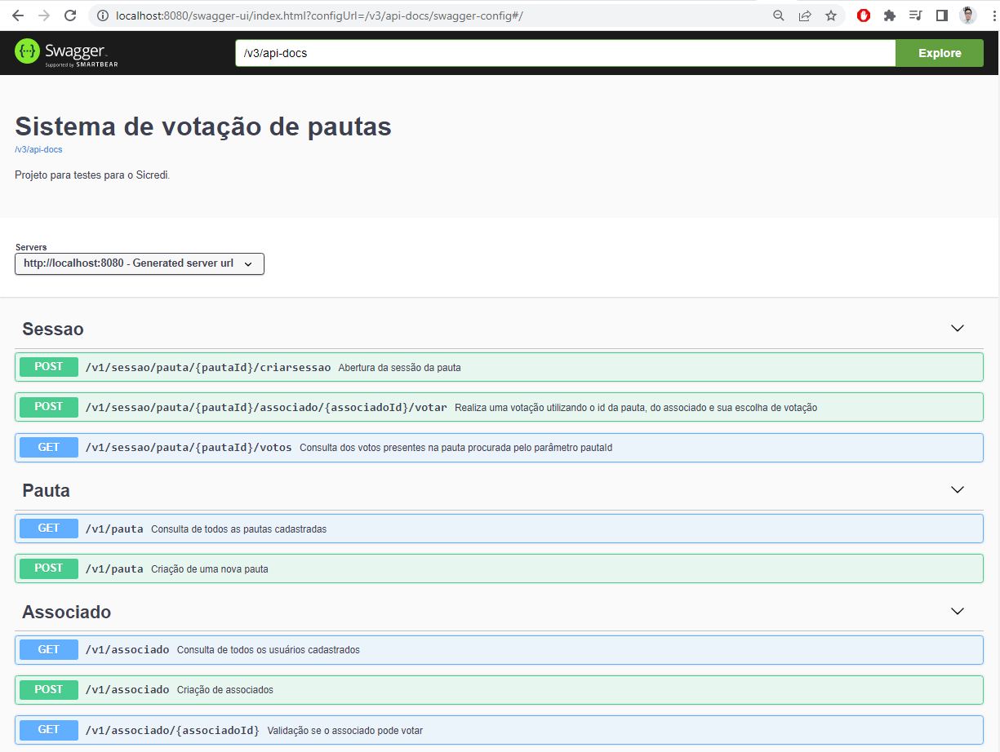
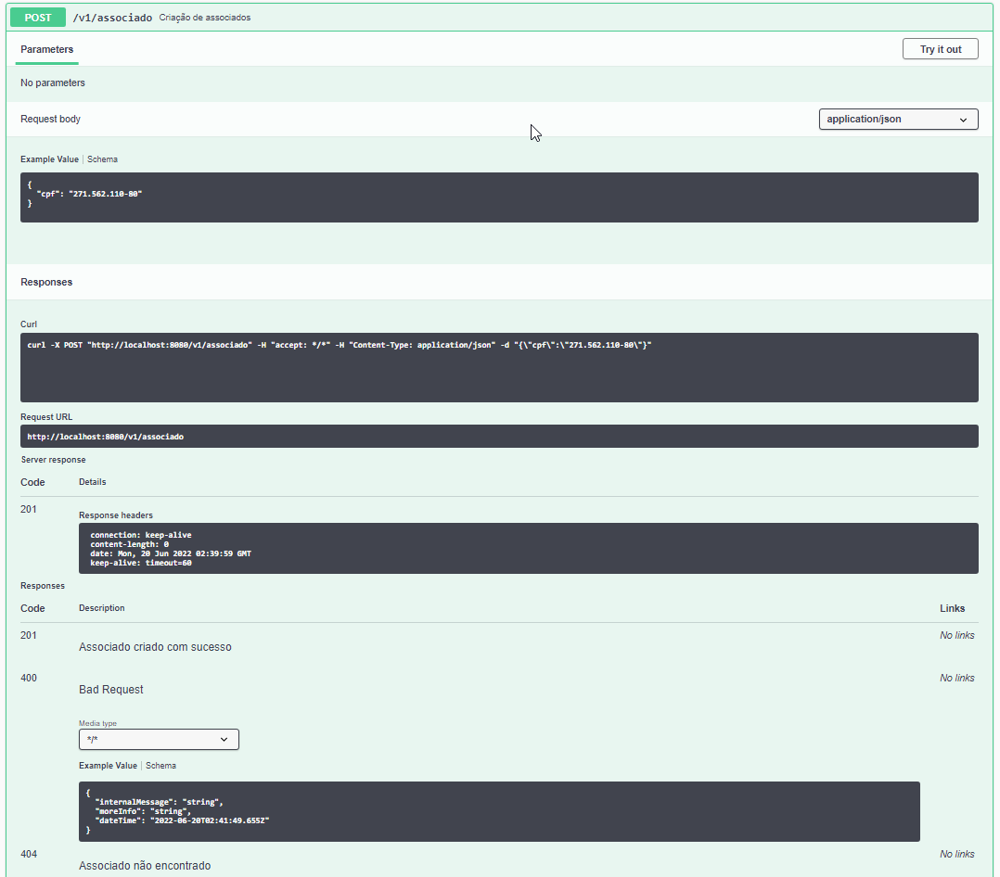

# Sistema de controle de votação de pautas

## Pré-requisitos

**Para executar corretamente é necessario ter instalado e configurado corretamente o docker e o docker-compose**

### Aplicação
Será criado um container com a aplicação e todas as suas dependências descritos no arquivo ```docker-compose.yml```, que podem ser orquestrada futuramente em uma aplicação dedicada (OCP, K8S, AWS, etc)

O container da imagem da aplicação é descrito no arquivo ```Dockerfile``` e é uma imagem com múltiplos estágios para diminuir o tamanho da imagem deployada.


## Execução da aplicação
A aplicação será executada com todas suas dependências dentro de um container docker e linkada com as dependências externas utilizando as configurações do docker-compose.
O sistema irá compilar o projeto seguindo os passos descritos no ```Dockerfile``` e sempre que uma imagem nova é gerada, é realizado o build completo da aplicação em um ambiente isolado do docker.

#### Comando para compilar as imagens da aplicação, na raiz do projeto executar o comando
```docker-compose build```

#### Comando para subir a aplicação e suas dependências, na raiz do projeto executar o comando
```docker-compose up```

## Api de documentação dos endpoints REST
### A documentação externa do projeto foi feita utilizando OPEN API 3.0, acessível pelo link abaixo:

```http://localhost:8080/swagger-ui/index.html?configUrl=/v3/api-docs/swagger-config#/```



### Criação de uma nova pauta


### Criação de um novo associado


### Validação se o associado pode votar via ```API externa```


### Abertura de uma nova sessao


### Receber votos de associados


### Votar em uma sessao


### Consultar os votos presentes em uma sessão


## O acesso ao banco de dados MongoDB utilizado pode ser realizado pelo link abaixo utilizando o mongo-express, as coleções do sistema estão na estrutura ```sicredi-api```

```http://localhost:8082/```


### Coleção dos associados no MongoDB


### Coleção das pautas no MongoDB


### Coleção dos votos no MongoDB


## Listagem dos eventos finalizados no tópico ```sessao-finalizada```


## Considerações
- Como banco foi escolhido um banco NoSQL pois as operações realizadas serão principalmente de criação e leitura, oque beneficia bastante esse tipo de abordagem no desempenho das operações
- Foram criados endpoints extra para facilitar a validação dos dados
- Os testes unitários são executados ao executar o comando ```mvn clean install``` e podem ser integrados a uma solução de CI / CD utilizando ferramentas como Sonar Cube.
- Na branch ```solucao-arquitetura-hexagonal```, existe uma versão mais complexa mas mais escalável e robusta
  - [Arquitetura hexagonal](https://github.com/andre-fujihara/sicredi-demo/tree/solucao-arquitetura-hexagonal)

# Tarefas do exercício

## Tarefa Bônus 1
- O sistema está integrado com a api externa ``` https://user-info.herokuapp.com/users/{cpf}```, que é chamada quando se faz uma chamada para realizar um voto ou para validar se um associado pode votar
- O cadastro do CPF ocorre somente no cadastro de um novo associado, após isso a interação é através do seu ID.

## Tarefa Bônus 2
- Para mensageria foi escolhido o kafka devido à performance e facilidade de uso
- Para o envio das sessões finalizadas foi criado um agendador que finaliza todas as sessões vencidas a cada minuto (o intervalo default) e a cada finalização é enviado um evento ao tópico do sistema de mensageria
- Consumidores externos podem se comunicar ao tópico para consumir as mensagens enviadas

## Tarefa Bônus 3
- O sistema foi projetado para ser Stateless e a aplicação pode ser escalável dependendo da solução escolhida e deployada dentro de um gerenciador de aplicações (Openshift, Kubernetes, aws)
- O banco escolhido foi um banco NoSQL por ser mais performático nas operações de leitura e escrita. A aplicação foi projetada para não realizar operações de atualização.
  - Pontos de melhoria poderia ser a utilização de cache e lógica para sua correta invalidação.
- Testes de performance não foram realizados

## Tarefa Bônus 4
- O versionamento das API's ocorre atualmente nas classes de Controllers da aplicação e a cada nova versão deveria-se atualizar essa variável